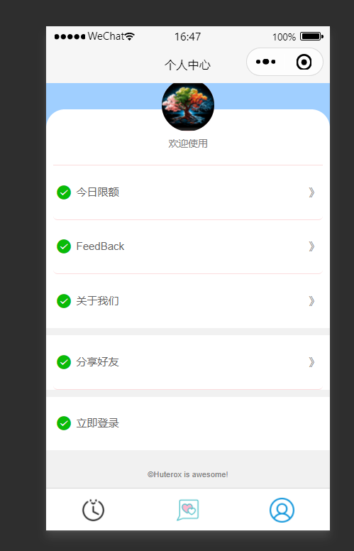

# GPT微信聊天小程序

## 介绍

基于GPT的微信聊天小程序，具备聊天记忆。模型基于GPT2进行开发。

关于更多开发细节可以查看我在CSDN发布的博文，博客名称：Huterox

为什么不采用GPT3.5？

1. 本次采用的GPT2是本地部署，打通，并提供服务的，虽然没有采用3.5或者是4，但是在技术实现难度上来说要比直接调用API“高级”。
2. 作者没钱，搭桥不安全。
3. 作为综合项目，调用API没啥意思，本地打通，为了完全可以尝试部署6B，等其他模型+本地知识库。

最后，本项目最终交付是作为期末作业进行交付的，因此没有做过多处理。

# 架构

基本的架构如下：

所以的话，整个项目启动，你会见到三个玩意。

## 小程序端
这个是个人中心

## 管理端

## 运维端

其他的就这样了。
这个结构非常简单。

# 交互
那么之后的话，就是交互。后端的话，基本上七七八八都说了一下，都是挺简单的东西。

那么这边的话我们，主要把注意力放在，前端这边。还有到后端的交互。

## 聊天页面
首先，最重要的当然就是聊天了。
聊天页面的话，设计的非常简单，也没有做什么特效，懒得做。
就这个玩意：

## 聊天发送流程
那么之后就是这个流程，这个玩意的话，比较简单。

然后这里的话，用户的验证啥的做的都很简单，直接用wid,感兴趣的自己可以去优化，也非常简单，这个就作为base beta 作孽版本搞了。

然后就是基本的后端处理逻辑。这个就没啥好说的了，还是比较简单的。

## 历史聊天记录
然后就是这个玩意：

，
这个玩意的前端代码比较简单，无非就是请求数据啥的。
然后比较主要的是后端的一个交互。
这里的话有两个玩意：

也就是这两个：

## 个人中心
个人中心的话其实就两个，一个是注册登录，还有一个是查看当前剩余次数。当时是想要做全套，再来个支付接口的。但是后来没时间，砍掉了。

这个是相应的前端代码实现：

# 其他
如果觉得还不错的话，可以来个start，奶茶钱都不要了。@[toc]
# GPT微信聊天小程序

## 介绍

基于GPT的微信聊天小程序，具备聊天记忆。模型基于GPT2进行开发。

关于更多开发细节可以查看我在CSDN发布的博文，博客名称：Huterox

为什么不采用GPT3.5？

1. 本次采用的GPT2是本地部署，打通，并提供服务的，虽然没有采用3.5或者是4，但是在技术实现难度上来说要比直接调用API“高级”。
2. 作者没钱，搭桥不安全。
3. 作为综合项目，调用API没啥意思，本地打通，为了完全可以尝试部署6B，等其他模型+本地知识库。

最后，本项目最终交付是作为期末作业进行交付的，因此没有做过多处理。

# 架构

基本的架构如下：

所以的话，整个项目启动，你会见到三个玩意。

## 小程序端
这个是个人中心

## 管理端

## 运维端

其他的就这样了。
这个结构非常简单。

# 交互
那么之后的话，就是交互。后端的话，基本上七七八八都说了一下，都是挺简单的东西。

那么这边的话我们，主要把注意力放在，前端这边。还有到后端的交互。

## 聊天页面
首先，最重要的当然就是聊天了。
聊天页面的话，设计的非常简单，也没有做什么特效，懒得做。
就这个玩意：

## 聊天发送流程
那么之后就是这个流程，这个玩意的话，比较简单。

然后这里的话，用户的验证啥的做的都很简单，直接用wid,感兴趣的自己可以去优化，也非常简单，这个就作为base beta 作孽版本搞了。

然后就是基本的后端处理逻辑。这个就没啥好说的了，还是比较简单的。

## 历史聊天记录
然后就是这个玩意：

，
这个玩意的前端代码比较简单，无非就是请求数据啥的。
然后比较主要的是后端的一个交互。
这里的话有两个玩意：

也就是这两个：

## 个人中心
个人中心的话其实就两个，一个是注册登录，还有一个是查看当前剩余次数。当时是想要做全套，再来个支付接口的。但是后来没时间，砍掉了。

这个是相应的前端代码实现：

# 其他
如果觉得还不错的话，可以来个start，奶茶钱都不要了。